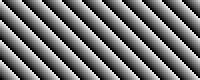

# CS 102 Final Project CFD (Computational Fluid Dynamics)

#### Making your own simulation environment

To make your own simulation environment, modify
[Template.java](src/Template.java). Don't forget to include in your workspace:
* [StdDraw.java](src/StdDraw.java)
* [RetinaIcon.java](src/RetinaIcon.java)
* [Simulation.java](src/Simulation.java)

Take a look at the examples for some inspiration:
* [Example 1](#Example-1)
* [Example 2](#Example-2)
* [Example 3](#Example-3)
* [Example 4](#Example-4)
* [CFD](#CFD)
* [CFD HD](#CFD-HD)

#### Example 1

  

Source code: [Example1.java](src/Example1.java)

#### Example 2

  

Source code: [Example2.java](src/Example2.java)

#### Example 3

  

Source code: [Example3.java](src/Example3.java)

#### Example 4

  

Source code: [Example4.java](src/Example4.java)

#### CFD

  

Source code: [CFD.java](src/CFD.java)

#### CFD_HD

  

Source code: [CFD_HD.java](src/CFD_HD.java)
