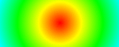
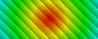
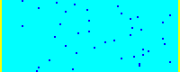

# CS 102 Final Project CFD (Computational Fluid Dynamics)
UNC CS 102 Spring 2017 Final Project Contest Winner

[Download Project (zip)](../../archive/master.zip)

<p align="center">
    <a href="https://drive.google.com/open?id=0By-CMfnYF6bZUVFIZG5GWFF3YVU"></a>
</p>

The math and physics was adapted from http://physics.weber.edu/schroeder/fluids/. They have an online CFD program, the source code in multiple programming languages, and even a [pdf file](http://physics.weber.edu/schroeder/javacourse/LatticeBoltzmann.pdf) that goes into detail how it works so if you are interested in CFD I reccomend checking it out.

### Table of contents
* [Making your own simulation environment](#making-your-own-simulation-environment)
* [Example 1](#example-1)
* [Example 2](#example-2)
* [Example 3](#example-3)
* [Example 4](#example-4)
* [Example 5](#example-5)
* [CFD](#cfd)
* [CFD HD](#cfd-hd)
* [Final Notes](#final-notes)

### Making your own simulation environment

To make your own simulation environment, modify
[Template.java](src/Template.java). Don't forget to include in your workspace:
* [StdDraw.java](src/StdDraw.java)
* [RetinaIcon.java](src/RetinaIcon.java)
* [Simulation.java](src/Simulation.java)

Take a look at the examples for some inspiration:

<a href="#example-1"></a>
<a href="#example-2"></a>
<a href="#example-3"></a>
<a href="#example-4"></a>
<a href="#example-5"></a>
<a href="#cfd"></a>
<a href="#cfd-hd"></a>

### Example 1
<p align="center">
  
</p>

Source code: [Example1.java](src/Example1.java)

This is a simple simulation that has only one variable that determines the brightness of a pixel:

```java
double B[][] = new double[xdim][ydim];
```

Initially each value in the 2d array is set to mod 10 of the sum of x and y. This creates the diagonal pattern with numbers 0 to 9.

```java
B[x][y] = (x + y) % 10.0;
```
At each time step we shift the numbers over by one 0->1, 1->2, ... , 9->0. This is done by incrementing the value by one and applying mod 10:

```java
B[x][y] = (B[x][y] + 1.0) % 10.0;
```

When we draw the pixels we take the `B[x][y]` value and scale it to a float value between 0.0f and 0.9f.
Then our new float value is used to determine the brightness value of our pixel.

```java
float b = (float) B[x][y] / 10.0f;
Color color = Color.getHSBColor(1.0f,0.0f,b);
```

### Example 2
<p align="center">
  
</p>

Source code: [Example2.java](src/Example2.java)

This is an example that is similar to [Example 1](#example-1) except we have this circular pattern expressed with different hues:

```java
double H[][] = new double[xdim][ydim];
```

The circular patter was created using the famous pythagorean theorem. There are things to consider like where the center of the circle should be and how frequent the pattern should repeat but this is the basic idea:

```java
// radius/distance from 0,0
double radius =  Math.sqrt(x*x + y*y);
// repeat every 10px away from center of circle
H[x][y] = (radius / 10.0) % 1.0;
```
At each time step we shift the numbers over by 0.1 similar to the previous example 0.0->0.1, 0.1->0.2, ... , 0.9->0.0.

```java
H[x][y] = (H[x][y] + 0.1) % 1.0;
```

When we draw the pixels we take the `H[x][y]` value and pass it as the hue value of our pixel.

```java
float h = (float) H[x][y];
Color color = Color.getHSBColor(h,1.0f,1.0f);
```

### Example 3
<p align="center">
  
</p>

Source code: [Example3.java](src/Example3.java)

This example is simply the first two combined. The colors are defined with two variables.

```java
float h = (float) H[x][y];
float b = (float) B[x][y];
Color color = Color.getHSBColor(h,1.0f,b);
```

### Example 4
<p align="center">
  
</p>

Source code: [Example4.java](src/Example4.java)

In this example there are 3 basic rules.
* Red goes to the right
* Blue goes to the left
* When either one is colliding with a yellow they will switch from red to blue and vise versa.

To accomplish this we use an enumeration as our variable:

```java
public enum State {
    EMPTY_SPACE, BARRIER, LEFT_PARTICLE, RIGHT_PARTICLE
}

public State[][] S = new State[xdim][ydim]; // states
```

For the initial conditions we set the left and right most column of values to `State.BARRIER` and one random x value per row to `State.LEFT_PARTICLE`. Everything else should just be empty space.

```java
// Start by setting everything to empty
for (int x = 0; x < xdim; x++){
    for (int y = 0; y < ydim; y++){
        S[x][y] = State.EMPTY_SPACE;
    }
}

// Add side walls and particles
for (int y = 0; y < ydim; y++){
    int left_x = 0;
    int right_x = xdim-1;
    // random x coordinate between barriers for particles
    int rand_x = (int) (Math.random() * (xdim-3) + 1);

    S[left_x][y] = State.BARRIER;
    S[right_x][y] = State.BARRIER;
    S[rand_x][y] = State.LEFT_PARTICLE;
}
```

Although it seems simple to code the three rules, it turns out that because there is an order to what gets updated first, the states can get messed up. To avoid this problem we can store the next states in a temporary 2d array and wait for the for loops to finish before updating our actual 2d array:

```java
State[][] tempS = new State[xdim][ydim];
// copy S into tempS
for (int x = 0; x < xdim; x++){
    for (int y = 0; y < ydim; y++){
        tempS[x][y] = S[x][y];
    }
}
// create the next states
for (int x = 0; x < xdim; x++){
    for (int y = 0; y < ydim; y++){
        // our three rules
    }
}
// now we can save our new states
S = tempS;
```

Take a look at the source code for a detailed look: [Example4.java](src/Example4.java)

### Example 5
<p align="center">
  
</p>

Source code: [Example5.java](src/Example5.java)

In this example we have what looks like ripples on a surface of water. At this point we have half of the CFD working. There are two methods that make the ripples happen `collide()` and `stream()`.

### CFD
<p align="center">
  
</p>

Source code: [CFD.java](src/CFD.java)

### CFD HD
<p align="center">
  
</p>

Source code: [CFD_HD.java](src/CFD_HD.java)

### Final Notes
If you would like to download the full project including the screenshots and videos click this link: [Download Full Project (zip)](../../archive/full.zip). Just note that it is a large file.
